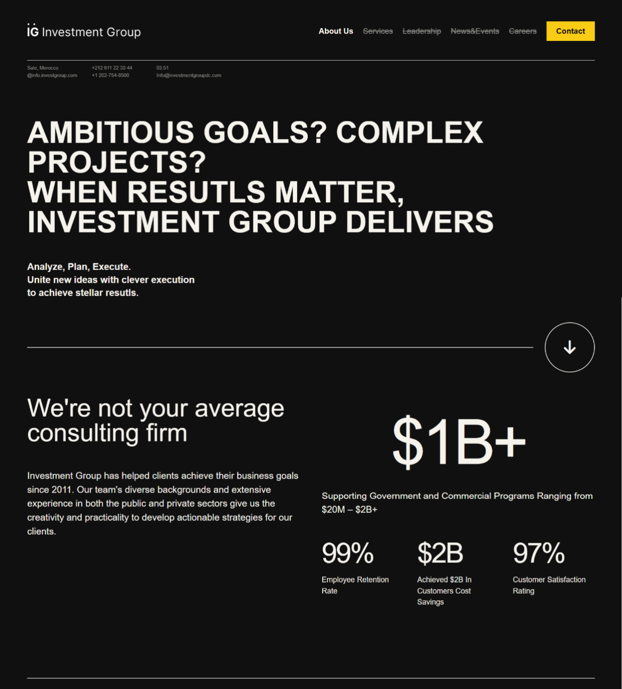

# [Live demo](https://portfoliowebdesignone.netlify.app)

# About

An eye-catching and aesthetically pleasing website, meticulously crafted for my portfolio, that showcases the talent I've gained from integrating HTML, Tailwind CSS, and JavaScript.

Feel free to explore the repository at your leisure to see the project in action and take it as testimony of my skills in producing sleek and premium web experiences.

# Screenshots

| Mobile                                | Desktop                                 |
| ------------------------------------- | --------------------------------------- |
|  |  |

# Highlights

1. **Fully** responsive design
2. Loading **animation**
3. **Smooth** page transitions
4. **Custom** video player
5. **Trailing** mouse
6. **horizontal scrolling** [about page](https://portfoliowebdesignone.netlify.app/about)
7. **Modular code** (ES6 modules)

## Fully responsive design

TailwindCSS played a pivotal role in implementing responsive design as it provies developers with a straightforward approach to responsiveness ensuring that web designs adapts seamlessly to various screen sizes.

Adding to that, I've integrated responsive units (vw and vh) to make all elements contract or expand proportionally to the viewport width or height with minimal code.

## Loading animation


For this features, I made use of the Local storage to run the loading animation every 10 min after the user's first visit and smooth page transitions in between. You can examine the relevant code snippet below for a closer examination at the implementation:

```javascript
  const loading_animation_params = () => {
  const user = localStorage.getItem("user");
  if (!user) {
    localStorage.setItem("user", JSON.stringify({ date: new Date() }));
    loadingAnimation();
    return;
  }

  if (user) {
    const visit_time = new Date(JSON.parse(localStorage.getItem("user")).date);
    const now = new Date();
    const time_diff = new Date(now - visit_time);
    if (time_diff.getMinutes() > 9) {
      loadingAnimation();
    // Resetting the visit time
      localStorage.setItem("user", JSON.stringify({ date: new Date() }));
      return;
  }
};
```

## Smooth page transitions


As explained earlier, if a user changes routes within the 10 minutes interval, a clip-path animation will be triggered to smooth transition from one page to another.

```javascript
if (time_diff.getMinutes() < 10) {
  pageTransition();
  return;
}
```

## Trailing mouse

A circle that follows the mouse mouvements using the mousemove event. Check the [cursor.js](public/common/cursor.js) file for an in-depth examination

## Custom video player


A video player with all the functionalities of moderm video players such as:

1. Fast forward/backward
2. Full screen mode
3. Captions
4. Volume slider
5. Keyboard shortcuts


Check the [video-controls.js](public/common/videocontrols.js) file for more in-depth examination.

<u>NB:</u> I did not include video quality controls as they suggest the need for streaming functionalities and a back-end. which falls outside the scope of this project.

## Horizontal scrolling

## Modular code
